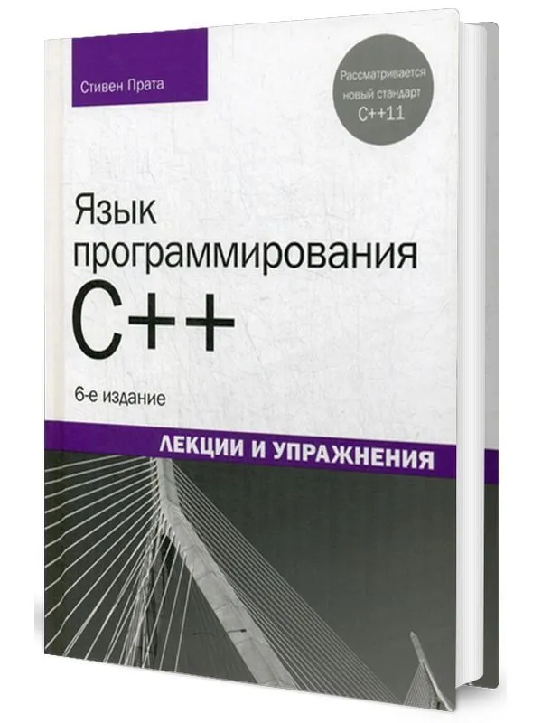

# Язык программирования C++. Лекции и упражнения. 6-е изд. Стивен Прата

Эта книга представляет собой один из лучших учебников по языку программирования C++ (C++11) для программистов и разработчиков. Эта классическая книга по C++ обучает принципам программирования, среди которых структурированный код и нисходящее проектирование, а также использованию классов, наследования, шаблонов, исключений, лямбда-выражений, интеллектуальных указателей и семантики переноса. Стивен Прата создал поучительное, ясное и строгое введение в C++. Фундаментальные концепции программирования излагаются вместе с подробными сведениями о языке C++. Множество коротких практических примеров иллюстрируют одну или две концепции за раз. Вопросы для самоконтроля и упражнения по программированию, предлагаемые в конце каждой главы, помогут читателям сосредоточиться на самой критически важной информации и систематизировать наиболее сложные концепции. Руководство подойдет как студентам, обучающимся программированию, так и разработчикам, имеющим дело с другими языками.

